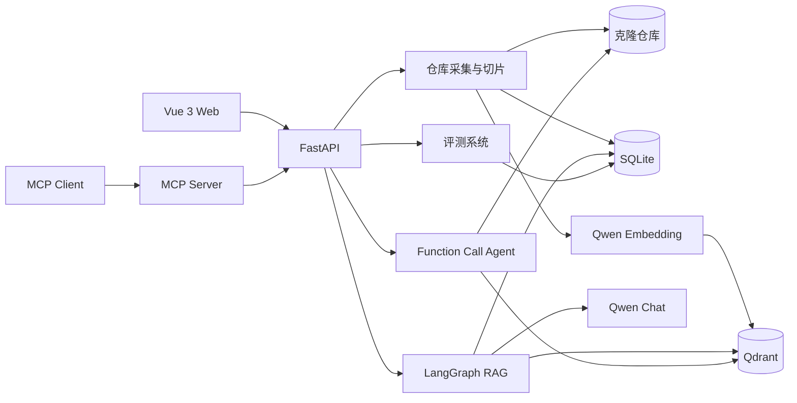

# RepoPilot

[](https://github.com/sokuse/RepoPilot/actions/workflows/ci.yml)

面向代码仓库维护场景的可追溯 AI 助手。RepoPilot 将 GitHub 仓库构建为可检索知识库，
通过 RAG、Function Call 和 LangGraph Agent 回答代码问题、调查故障，并用长期记忆保存
历史经验，用固定测试集评估不同方案的真实效果。

> 当前版本定位为完整的学习与作品集项目，重点展示从仓库采集、向量检索到 Agent、评测、
> MCP 和容器化部署的端到端工程实现，不是 Codex 或 Claude Code 的替代品。

## 项目亮点

- **可追溯代码问答**：回答中的引用可定位到真实文件、行号和知识切片，而不是只返回模型结论。
- **Agent 工具调查**：模型可自主执行语义搜索、正则 Grep、文件读取、文件列表和仓库统计，
  并保留完整调用轨迹。
- **长期项目记忆**：持久化历史问答、用户反馈和诊断结论，新问题可同时召回代码与过去经验。
- **可量化评测**：使用同一测试集对比纯检索、RAG、单 Agent 和多 Agent，记录准确率、证据、
  Token 与耗时，避免仅凭主观感受选择方案。
- **标准化能力输出**：通过 MCP Server 将搜索、读取、记忆、诊断和评测能力提供给外部 MCP 客户端。
- **完整工程闭环**：Vue 前端、FastAPI API、SQLite、Qdrant、GitHub Actions 与 Docker Compose
  均已接入。

## 系统架构



一次典型请求的执行链路：

```text
接入 GitHub 仓库
  → 浅克隆与安全扫描
  → 结构感知切片
  → Qwen Embedding
  → Qdrant 向量索引
  → 语义召回
  → RAG / Agent 分析
  → 引用校验与结果持久化
```

## 核心能力

### 1. 仓库知识库

- 后台浅克隆公开 GitHub 仓库，按目录、扩展名、大小和二进制特征过滤文件。
- 使用 Python AST、Markdown 标题和 LangChain 语言感知递归策略切片。
- 保存文件路径、语言、SHA-256、起止行号、符号名、切片策略和内容哈希。
- 调用百炼 `text-embedding-v4` 生成向量，并按项目隔离写入 Qdrant。
- 支持嵌入式 Qdrant 本地开发模式和独立 Qdrant 服务模式。

### 2. 可追溯 RAG

- LangGraph 编排“语义召回 → Qwen 生成 → 引用校验”。
- 使用 `[S编号]` 将答案映射回真实文件和行号。
- 通过 SSE 流式返回召回结果、文本增量、执行步骤与最终报告。
- 在 SQLite 中保存模型、Token、耗时、切片快照和引用快照。

### 3. Agent 诊断

- 单 Agent 通过 Function Call 自主选择语义搜索、正则 Grep、文件读取、文件列表和仓库统计工具。
- `semantic_search` 负责按自然语言定位相关实现；`grep_repository` 负责精确查找符号名、错误码、
  配置键和调用位置，支持正则表达式、大小写控制、路径前缀及结果上限，并返回文件、行号和列号。
- 多 Agent 使用 LangGraph 串联规划、工具调查和证据审查流程。
- 设置最大迭代次数，并展示工具参数、结果摘要、耗时和累计 Token。
- 审查 Agent 对结论的证据忠实度评分，在输出异常时安全回退。

### 4. 对话与长期记忆

- 保存会话、消息、RAG 运行关联及“有帮助/没帮助”反馈。
- 短期记忆使用当前会话最近消息；长期记忆经过切片和 Embedding 后写入独立 Qdrant collection。
- 新问题同时检索仓库代码、历史对话和过去诊断记录，并区分 `[S编号]` 代码证据与
  `[M编号]` 记忆证据。

### 5. Agent 评测

- 创建包含问题、期望文件和必要关键词的项目级测试集。
- 创建题目时校验期望文件确实存在于目标仓库，防止无效测试集产生误导分数。
- 对比 `retrieval`、`rag`、`single_agent` 和 `multi_agent` 四种模式。
- 生成模式的综合分为：文件召回 `45%` + 关键词覆盖 `30%` + 证据可信度 `25%`；
  纯检索模式只计算文件召回。
- 保存和删除历史实验，并保留每道题的答案、错误、Token、耗时和配置快照。

### 6. MCP 与部署

- MCP 提供项目列表、仓库搜索、受限文件读取、记忆搜索、RAG 历史、诊断和评测查询工具。
- 默认使用本地 `stdio`，也可启动仅监听本机的 Streamable HTTP 服务。
- Docker Compose 一键启动 Vue、FastAPI 和 Qdrant，使用命名卷持久化仓库、SQLite 与向量数据。
- GitHub Actions 自动执行 Ruff、Pytest、Vue 类型检查、前端构建和 Compose 配置校验。

## 技术栈

| 层级 | 技术 |
| --- | --- |
| 前端 | Vue 3、TypeScript、Vue Router、Vite |
| API | Python 3.11+、FastAPI、Pydantic |
| AI 编排 | LangGraph、Function Call、SSE |
| 模型 | 阿里云百炼 Qwen Chat、`text-embedding-v4` |
| 数据 | SQLAlchemy、SQLite、Qdrant |
| 协议 | MCP Python SDK v2 |
| 工程化 | Pytest、Ruff、Docker Compose、Nginx、GitHub Actions |

## 快速开始

### 方式一：Docker Compose

要求：Docker Desktop 已启动，并已启用 WSL 2/虚拟化。

```powershell
Copy-Item backend/.env.example backend/.env
# 编辑 backend/.env，填写 REPOPILOT_QWEN_API_KEY
docker compose up --build -d
```

启动后访问：

- Web：http://localhost:5173
- API：http://localhost:8000
- OpenAPI：http://localhost:8000/docs
- Qdrant Dashboard：http://localhost:6333/dashboard

查看状态和停止服务：

```powershell
docker compose ps
docker compose logs -f backend
docker compose down
```

`docker compose down` 会保留命名卷；只有显式增加 `-v` 才会删除 Docker 环境的数据。
完整说明见 [Docker Compose 部署](docs/docker.md)。

### 方式二：本地开发

后端：

```powershell
cd backend
python -m venv .venv
.\.venv\Scripts\Activate.ps1
python -m pip install -e ".[dev]"
Copy-Item .env.example .env
# 编辑 .env，填写 REPOPILOT_QWEN_API_KEY
uvicorn repopilot.main:app --reload
```

新建终端启动前端：

```powershell
cd frontend
npm install
npm run dev
```

本地模式默认使用 `backend/repopilot.db` 和 `backend/data/qdrant`；Docker 使用独立命名卷，
两套环境不会自动共享项目和索引数据。

## 使用流程

1. 在“项目工作台”填写仓库名称、公开 GitHub 地址和默认分支。
2. 等待仓库状态变为“就绪”，检查文件数量和语言统计。
3. 生成知识切片，再构建 Qdrant 向量索引。
4. 在“知识检索”中执行语义搜索或创建对话进行 RAG 问答。
5. 在“智能诊断”中选择单 Agent 或多 Agent，并查看工具调用证据。
6. 开启开发者模式后，在“评测实验”中用固定测试集比较不同方案。

多 Agent 和批量评测会产生更多模型调用，建议先运行纯检索验证测试集，再逐步运行生成模式。

## 关键配置

配置文件为 `backend/.env`，真实密钥不会提交到 Git。

| 变量 | 默认值 | 作用 |
| --- | --- | --- |
| `REPOPILOT_QWEN_API_KEY` | 无 | Qwen Chat 与 Embedding 共用的百炼 API Key |
| `REPOPILOT_CHAT_MODEL_NAME` | `qwen-plus` | RAG 与 Agent 使用的聊天模型 |
| `REPOPILOT_EMBEDDING_MODEL_NAME` | `text-embedding-v4` | Embedding 模型 |
| `REPOPILOT_EMBEDDING_DIMENSIONS` | `1024` | 向量维度，必须与索引一致 |
| `REPOPILOT_VECTOR_DATABASE_URL` | 空 | 留空使用嵌入式 Qdrant；Docker 中指向 `qdrant:6333` |
| `REPOPILOT_CHUNK_SIZE_CHARS` | `1500` | 递归切片目标长度 |
| `REPOPILOT_CHUNK_OVERLAP_CHARS` | `200` | 相邻切片重叠长度 |
| `REPOPILOT_RAG_RETRIEVAL_LIMIT` | `8` | RAG 默认召回数量 |

修改 Embedding 模型或向量维度后，需要重新构建向量索引。

## MCP Server

先启动 FastAPI，再由 MCP 客户端启动本地 stdio Server：

```powershell
cd backend
.\.venv\Scripts\repopilot-mcp.exe
```

stdio 模式会等待客户端通过标准输入输出通信，因此终端没有普通日志属于正常现象。
如需 Streamable HTTP，可执行：

```powershell
docker compose --profile mcp up --build -d
```

详细客户端配置、工具清单和安全边界见 [RepoPilot MCP 接入](docs/mcp.md)。

## 项目结构

```text
RepoPilot/
├─ backend/
│  ├─ src/repopilot/
│  │  ├─ api/          # FastAPI 路由
│  │  ├─ services/     # 采集、切片、RAG、Agent、记忆与评测
│  │  ├─ models/       # SQLAlchemy 数据模型
│  │  ├─ schemas/      # Pydantic 请求与响应结构
│  │  └─ mcp_server.py # MCP 工具入口
│  └─ tests/           # 后端自动化测试
├─ frontend/src/
│  ├─ views/           # 工作台、知识检索、智能诊断、评测实验
│  ├─ services/        # API 客户端
│  └─ types/           # TypeScript 类型
├─ docs/               # Docker 与 MCP 文档
├─ .github/workflows/  # CI
└─ compose.yaml
```

## 开发检查

```powershell
backend\.venv\Scripts\python.exe -m ruff check backend\src backend\tests
backend\.venv\Scripts\python.exe -m pytest backend\tests -q
npm --prefix frontend run typecheck
npm --prefix frontend run build
docker compose config --quiet
```

## 当前边界与后续方向

当前版本主要面向单机学习和演示：只接入公开 GitHub 仓库，使用本地文件系统和 SQLite，
尚未提供用户认证、团队权限、远程对象存储和分布式任务队列。

若面向真实团队部署，可继续增加：

- OAuth / RBAC 与项目成员权限
- PostgreSQL、对象存储和托管 Qdrant
- Celery、RQ 或其他异步任务队列
- 私有仓库授权与 Webhook 增量索引
- 链路追踪、模型成本预算与生产监控
- 团队共享的维护记录、诊断审批和审计日志
